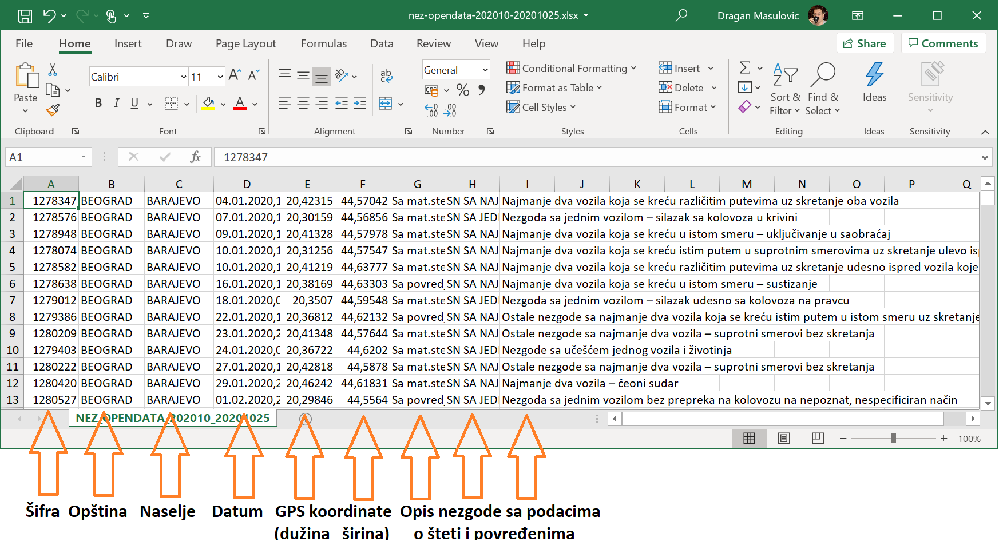
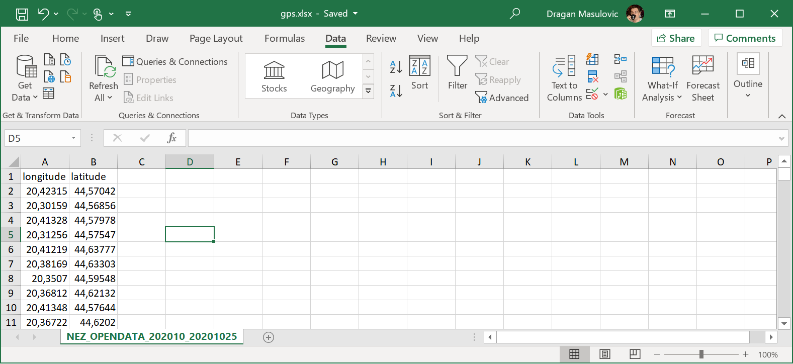
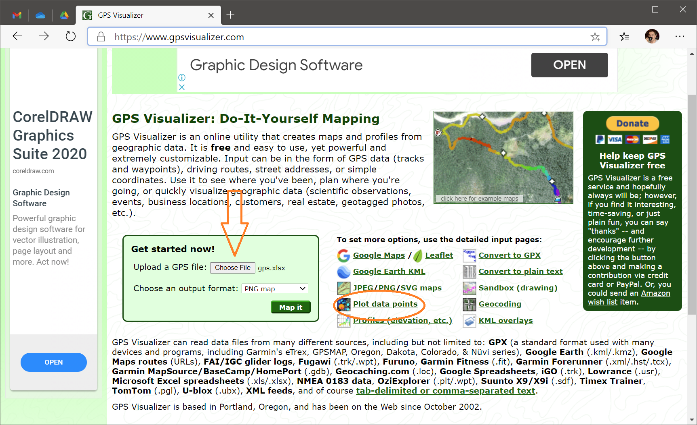

Анализа саобраћајних несрећа
=====================================================================================================

.. infonote::

   Колико си безбедан у саобраћају?
   
   Колико су житељи твог краја стабилни возачи?
   
   Где су саобраћајне "црне тачке" у твом крају?

   Ниво амбициозности пројекта: * *
   

Циљ истраживања
-------------------------

Безбедност у саобраћају је од пресудног значаја за добробит свих учесника у саобраћају: од пешака
до возача. С друге стране, у нашој земљи често постоје проблеми са одржавањем путева и постављањем саобраћајне сигнализације,
као и са поштовањем Закона о безбедности у саобраћају од стране свих учесника у саобраћају.

Циљ истраживања је да се анализом података о саобраћајним несрећама у последњих пет година
утврди структура саобраћајних несрећа у твом крају и да се идентификују и
визуелизују саобраћајне "црне тачке".

Ресурси и вештине
------------------------

За реализацију овог пројектног задатка потребно је:

1. Пет рачунара на којима је инсталиран Microsoft Office
2. Прикључак на Интернет
3. Штампач

Реализација овог пројектног задатка укључује следеће активности:

1. Прибављање података са портала отворених података
2. Обрада података (MS Excel)
3. Вођење евиденције о уложеном времену за потребе самовредновања (Google Documents)
4. Израда извештаја (MS Word)
5. Израда презентације (MS PowerPoint)

Формирање тима
------------------------

Тим треба поделити на следеће радне групе:

1. Радна група за анализу података из 2020. године
2. Радна група за анализу података из 2019. године
3. Радна група за анализу података из 2018. године
4. Радна група за анализу података из 2017. године
5. Радна група за анализу података из 2016. године

Прикупљање и обрада података
----------------------------

На адреси `data.gov.rs <https://data.gov.rs/sr/>`_ се налази Портал отворених података Републике Србије на коме
се редовно објављују званични подаци о низу појава у Србији. Између осталог, Министарство унутрашњих послова
редовно објављује податке о саобраћајним несрећама на територији целе државе, организоване по годинама.

Овај `ЛИНК <https://data.gov.rs/sr/datasets/podatsi-o-saobratshajnim-nezgodama-po-politsijskim-upravama-i-opshtinama/>`_
те води директно на званичне податке о саобраћајним несрећама, где се подаци за сваку годину налазе у одговарајућем
Ексел фајлу.

Нека свака радна група треба да преузме податке за своју годину. Свака од преузетих табела има следећу структуру:

Свака радна група треба да издвоји податке за своје окружење (округ, општину, насеље, како се тимови договоре)
и да у облику Ексел табеле приреми анализу о броју саобраћајних несрећа:

1. по месецима (јануар, фебраур, ...)
2. по данима у недељи (колико је било несрећа понедељком, колико уторком, ...)
3. у посебнима данима у години (државни празници); ове податке треба упоредити са просечним дневним бројем саобраћајних несрећа на годишњем нивоу
4. по врсти (са повредама, само материјална штета, ...; обратити пажњу на то да скраћеница SN која је јавља у описима значи "саобраћајна несрећа")

Све добијене податке треба илустровати одговарајућим дијаграмима у Екселу.

Да би се идентификовале саобраћајне "црне тачке" свака радна група треба да прикаже податке о локацијама на којима се десила
несрећа на карти. За ову анализу погодно је користити неки од јавно доступних и бесплатних сервиса за приказивање
географских података као што је `GPS Visualizer <https://www.gpsvisualizer.com/>`_.

Уколико се одлучите за коришћење овог сервиса, податке треба прирпремити на следећи начин:

1. направити нову Ексел табелу из које су уклоњене све колоне осим колона које садрже GPS координате саобраћајне несреће
2. тако добијеној табели треба додати заглавље које објашњава врсту података у табели: прву колону назвати "longitude" (енгл. географска дужина), а другу "latitude" (енгл. географска ширина)

Добијена табела треба да изгледа отприлике овако:

Овако припремљену табелу треба послати систему кликом на дугме "Choose file" и онда одабрати сервис "Plot data points" да би
сервис генерисао мапу која сваку локацију чије координате су наведене у Ексел фајлу приказује тачком на мапи:

Када радне групе заврше анализу свака за своју годину, све радне групе заједно анализирају укупан петогодишњи период
и покушавају да утврде

1. да ли постоје обрасци у понашању учесника у саобраћају који се нису променили током ових пет година
2. да ли постоје трендови у вези са побољшањем/погоршањем ситуације у саобраћају у окружењу.

Самовредновање
---------------------------------

Током рада на реализацији пројекта сваки учесник пројекта за себе
води дневник у облику *дељеног документа у облаку* који има следећу структуру:
::

                  | Датум 1 | Датум 2 | Датум 3 | ...
    -----------------------------------------------------
      Члан тима 1 |  време  |         |         | ...
    -----------------------------------------------------
      Члан тима 1 |         |         |         | ...
    -----------------------------------------------------
      Члан тима 3 |         |         |         | ...
    -----------------------------------------------------
      ...         |         |         |         | ...

У овај документ сваки члан тима уноси податке о томе колико времена је провео на пословима бављења пројектом.

Извештавање
-------------------------------

По завршетку анализе података свака радна група припрема извештај о саобраћајним несрећама за своју годину.

Све радне групе припремају заједно још два извештаја:

1. Збирни извештај о анализи петогодишњег периода
2. Извештај о самовредновању у коме се анализира колико времена је утрошено на овај посао по ученику и по датуму и подаци се приказују одговарајућим дијаграмима.

Извештаји о саобраћајним несрећама (за сваку годину посебно и Збирни извештај)
се подносе целом разреду и наставнику који треба да посвети један час њиховој анализи.
Чланови тима треба да прокоментаришу Извештај о самовредновању.
Презентацију резултата пројекта припремити у MS PowerPoint-у.

Извештаји о саобраћајним несрећама (за сваку годину посебно и Збирни извештај) се подносе управи школе са
молбом да се објаве на огласној табли и/или на сајту школе.

.. infonote::

   Уколико је то могуће у процес сумирања утисака укључити шири круг људи. Рецимо,
   презентовати извештај на родитељском састанку, али и изван школе како (ако то прилике допуштају)
   би у цео процес била укључена и локална заједница.
