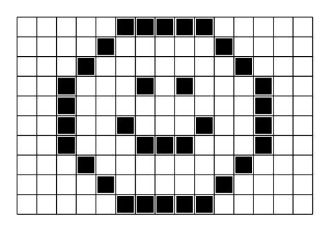
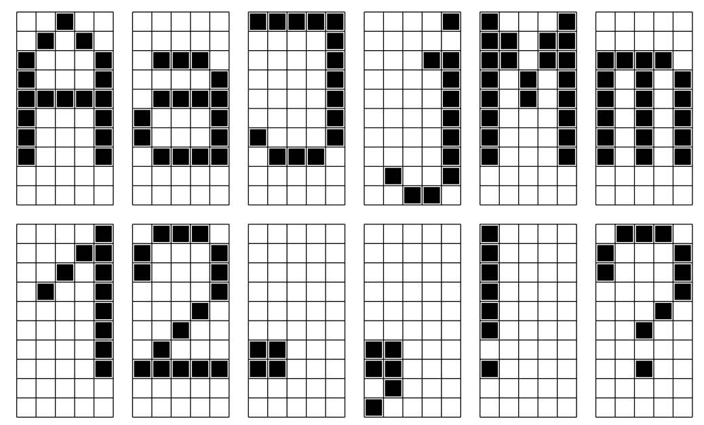
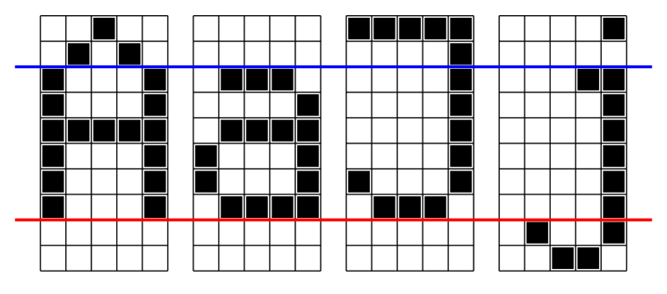
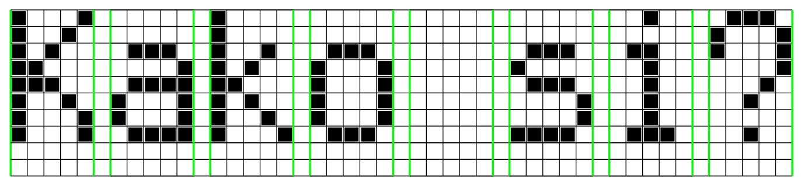

Оптичко препознавање знакова (Optical Character Recognition, OCR)
=================================================================

.. infonote::

   Како рачунар претвара бројева, слова и знакове интерпункције са дигиталних докумената у симболе које могу да читају други програми?

   Ниво амбициозности пројекта: `**`

Циљ пројекта
-------------------------

Циљ пројекта је да се демонстрира једна једноставна техника оптичког препознавања знакова
која се заснива на препознавању знакова употребом хистограма. Резултат пројекта треба да буде
програм у Пајтону који учита поједностављену "дигиталну слику", препознаје симболе на тој слици
и потом формира и исписује одговарајући стринг.

Ресурси и вештине
------------------------

За реализацију овог пројектног задатка потребно је:

1. Два рачунара са инсталираним Пајтоном.

Реализација овог пројектног задатка укључује следеће активности:

1. Припрему и анализу фонта који ће програм моћи да препозна,
2. Писање програма који препознаје симболе.

Формирање тима
------------------------

Тим треба поделити на следеће радне групе:

1. Радна група за припрему фонта 
2. Радна група за препознавање текста.

Увод - растерска слика, растерски фонт
--------------------------------------

*Растерска слика* је правоугаона шема (кажемо још и *матрица*) тачака (које још зовемо и *пиксели*).
На пример, ово је једна растерска слика:

Ова слика је *црно-бела*, а димензије су јој 10х15 пиксела.

*Фонт* представља систем који одређује облик и величину симбола (слова, цифара, знакова интерпункције).
*Растерски фонт* је фонт код кога су симболи представљени растерским сликама. На пример, ево неколико
симбола једног једноставног растерског фонта:

Видимо да је сваки симбол "упакован" у оквир димензија 10х5 пиксела. Ако пажљиво анализирамо прва четири симбола:

примећујемо да слова ``А``, ``а`` и ``Ј`` "стоје" на црвеној линији (која се зове *основна линија*), док слово ``ј`` силази испод основне
линије. Такође, велика слова (као и тачка изнад ``ј``) се протежу изнад плаве линије (која се зове *основна висина*),
док је "тело" сваког малог слова (које не силази испод основне линије) упаковано између црвене и плаве линије у оквир димензија 6х5.

Текст се исписује растерским фонтом тако што се "цртежи" слова ређају у ред, с тим да се између свака два оквира 10х5 остави по
један пиксел размака: 

Припрема фонта
----------------------------

Обе радне групе треба прво да се договоре о скупу симбола који ће моћи да буду препознати (српска ћирилица, српска латиница,
слова енглеске абецеде, или нешто друго). Тај скуп треба да укључује велика слова, мала слова, цифре и неке од знакова интерпункције.

Радна група за припрему фонта потом треба да припреми растерску репрезентацију сваког симбола, односно, да га
прикаже матрицом тачкица формата 10х5 поштујући правила која су описана у претходном одељку.
Сваки симбол треба да буде описан листом стрингова, рецимо овако:

.. code-block:: python

   Slovo_A = [      Slovo_a = [
     '  X  ',        '     ',
     ' X X ',        '     ',
     'X   X',        ' XXX ',
     'X   X',        '    X',
     'XXXXX',        ' XXXX',
     'X   X',        'X   X',
     'X   X',        'X   X',
     'X   X',        ' XXXX',
     '     ',        '     ',
     '     '         '     '
   ]               ]

Бели пиксели су овде представљени празнином, док су црни пиксели представљени симболом ``X``.

Препознавање текста
----------------------------

Радна група за препознавање текста треба од радне групе за припрему фонта да преузме описе симбола и да
направи Пајтон програм који ће из текстуалне датотеке да учита "дигитални текст" и да га конвертује у стринг.
"Дигитални текст" представља текст који се састоји од десет редова и изгледа отприлике овако:
::

    X   X       X                     X        XXX
    X  X        X                             X   X
    X X    XXX  X  X   XXX           XX  XXX  X   X
    XX        X X X   X   X           X X   X     X
    XXX    XXXX XX    X   X           X XXXXX    X
    X  X  X   X X X   X   X           X X       X
    X   X X   X X  X  X   X           X X  
    X   X  XXXX X   X  XXX            X  XXXX   X
                                  X   X
                                   XX

пајтон програм кога треба написати треба да учита десет редова из датотеке, да из "исече" на растерску
репрезентацију појединих слова и да тако добијене низове стрингова (по десет за свако слово) упореди
са описима који су добијени од тима за припрему фонта. Програм потом треба да формира стринг са препознатим
текстом и да га испише на монитор. На пример, за горњи "дигитални текст" програм треба да испише:
::

   Kako je?

Када тим развије алгоритам који анализира и препознаје један ред "дигиталног текста", програм треба
унапредити тако да може да препозна "дигитални текст" који је организован у више редова.
Препоручује се да два суседна реда у "дигиталном тексту" буду раздвојена једним празним редом. На пример
за следећи "дигитални текст":
::

    X   X       X                     X        XXX
    X  X        X                             X   X
    X X    XXX  X  X   XXX           XX  XXX  X   X
    XX        X X X   X   X           X X   X     X
    XXX    XXXX XX    X   X           X XXXXX    X
    X  X  X   X X X   X   X           X X       X
    X   X X   X X  X  X   X           X X  
    X   X  XXXX X   X  XXX            X  XXXX   X
                                  X   X
                                   XX

     XXX   XXX   XXX   XXX   XXX   XXX   XXX   XXX
    X   X X   X X   X X   X X   X X   X X   X X   X
    X   X X   X X   X X   X X   X X   X X   X X   X
        X     X     X     X     X     X     X     X
       X     X     X     X     X     X     X     X
      X     X     X     X     X     X     X     X
                                              
      X     X     X     X     X     X     X     X

програм треба да испише:
::

   Kako je?
   ????????

Самовредновање
---------------------------------

Током рада на реализацији пројекта сваки учесник пројекта за себе
води дневник у облику *дељеног документа у облаку* који има следећу структуру:
::

                  | Датум 1 | Датум 2 | Датум 3 | ...
    -----------------------------------------------------
      Члан тима 1 |  време  |         |         | ...
    -----------------------------------------------------
      Члан тима 2 |         |         |         | ...
    -----------------------------------------------------
      Члан тима 3 |         |         |         | ...
    -----------------------------------------------------
      ...         |         |         |         | ...

У овај документ сваки члан тима уноси податке о томе колико времена је провео на пословима бављења пројектом.

Извештавање
-------------------------------

По завршетку обе радне групе припремају заједнички извештај о решењу које су имплементирали,
уоченим проблемима (како програмерским, тако и у раду са другим члановима тима) и могућностима
да се пројекат побољша.

Обе радне групе припремају заједно још и Извештај о самовредновању у коме се анализира колико времена је утрошено на
овај посао по ученику и по датуму и подаци се приказују одговарајућим дијаграмима.

Извештај се подноси целом разреду и наставнику који треба да посвети један час његовој анализи.
Чланови тима треба да прокоментаришу Извештај о самовредновању.
Презентацију резултата пројекта припремити у MS PowerPoint-у, или у облику плаката који касније
може да буе истакнут на видном месту у школи.

