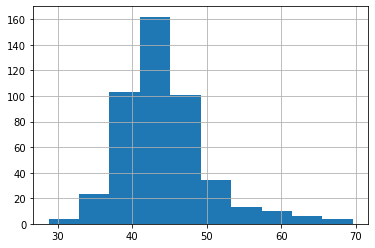

Пример скупа података за пројектно учење
========================================

Идеја пројектног учења је да оно што сте научили примените на конкретан
проблем и онда пустите исти тај проблем да вас још нешто научи. При
томе, наравно, нико не очекује да решавање проблема буде праволинијско.
Има детаља којих ћете морати да се подсетите, док ћете неке трикове
“успут” морати да научите. Тражење сличних примера и решења је увек
дозвољено и врло пожељно.

.. technicalnote::

    Препоручујемо да ову лекцију покренеш на свом рачунару тако што ћеш у `фолдеру за рад офлајн <https://github.com/Petlja/os8_inf_proj_prog_radni/archive/refs/heads/main.zip>`_ покренути Џупитер свеску `projekat1.ipynb` на начин на који је то објашњено у поглављу ``Покретање Џупитер радних свески у Курсу за осми разред``.

Пројектни задатак – Упис у средње школе
---------------------------------------

Министарсво просвете је у јулу 2022. објавило табелу са минималним
бројем бодова и бројем преосталих места за упис за све образовне профиле
у више од 300 средњих школа. Ми смо је сачували у фајлу
“data/preostala-mesta-profili.csv”. То је оригинал табеле коју у лекцији
“Основе обраде и приказа табеларних података” користимо у скраћеној
форми. Ваш је задатак да направите преглед ових података за место у ком
намеравате да упишете средњу школу.

Ми вам овде нећемо дати рецепт како да обрадите и прикажете податке. То
морате сами. Даћемо вам само неке примере и подсетнике. Као прво,
учитајте табелу. Не заборавите да увезете за то потребне библиотеке.

.. code:: ipython3

    import pandas as pd
    import matplotlib.pyplot as plt
    df = pd.read_csv('data/preostala-mesta-profili.csv')

Ова табела је “и више и шира” од скраћеног примера који смо раније
обрадили. Погледајте које све колоне сада имате. Има ту нових детаља.
Најважније је што имамо податке за сваки образовни профил.

.. code:: ipython3

    df.columns

.. parsed-literal::

    Index(['Шифра', 'Назив', 'Подручје рада', 'Школа - МБ', 'Школа - Назив',
           'Школа - Место', 'Школа - Општина', 'Школа - Округ', 'Укупно места',
           'Трајање', 'Језик', 'Тип профила', 'Специјализован', 'Спортски',
           'Мин. бодова 1K', 'Преостало места 1K'],
          dtype='object')

.. code:: ipython3

    df.head()

.. raw:: html

    

    
    <table border="1" class="dataframe">
      <thead>
        <tr style="text-align: right;">
          <th></th>
          <th>Шифра</th>
          <th>Назив</th>
          <th>Подручје рада</th>
          <th>Школа - МБ</th>
          <th>Школа - Назив</th>
          <th>Школа - Место</th>
          <th>Школа - Општина</th>
          <th>Школа - Округ</th>
          <th>Укупно места</th>
          <th>Трајање</th>
          <th>Језик</th>
          <th>Тип профила</th>
          <th>Специјализован</th>
          <th>Спортски</th>
          <th>Мин. бодова 1K</th>
          <th>Преостало места 1K</th>
        </tr>
      </thead>
      <tbody>
        <tr>
          <th>0</th>
          <td>BOBOGA4R01S</td>
          <td>Друштвено - језички смер</td>
          <td>Гимназија</td>
          <td>7414269</td>
          <td>Гимназија "Бора Станковић"</td>
          <td>Бор</td>
          <td>Бор</td>
          <td>Борски управни округ</td>
          <td>60</td>
          <td>4</td>
          <td>Српски</td>
          <td>Редовнo</td>
          <td>НЕ</td>
          <td>НЕ</td>
          <td>54.43</td>
          <td>38</td>
        </tr>
        <tr>
          <th>1</th>
          <td>BOBOGA4R04S</td>
          <td>Природно - математички смер</td>
          <td>Гимназија</td>
          <td>7414269</td>
          <td>Гимназија "Бора Станковић"</td>
          <td>Бор</td>
          <td>Бор</td>
          <td>Борски управни округ</td>
          <td>30</td>
          <td>4</td>
          <td>Српски</td>
          <td>Редовнo</td>
          <td>НЕ</td>
          <td>НЕ</td>
          <td>77.51</td>
          <td>3</td>
        </tr>
        <tr>
          <th>2</th>
          <td>BOBOSB4L01S</td>
          <td>Економски техничар</td>
          <td>Економија, право и администрација</td>
          <td>7351771</td>
          <td>Економско-трговинска школа</td>
          <td>Бор</td>
          <td>Бор</td>
          <td>Борски управни округ</td>
          <td>30</td>
          <td>4</td>
          <td>Српски</td>
          <td>Редовнo</td>
          <td>НЕ</td>
          <td>НЕ</td>
          <td>55.09</td>
          <td>16</td>
        </tr>
        <tr>
          <th>3</th>
          <td>BOBOSB4L05S</td>
          <td>Правно - пословни техничар</td>
          <td>Економија, право и администрација</td>
          <td>7351771</td>
          <td>Економско-трговинска школа</td>
          <td>Бор</td>
          <td>Бор</td>
          <td>Борски управни округ</td>
          <td>30</td>
          <td>4</td>
          <td>Српски</td>
          <td>Редовнo</td>
          <td>НЕ</td>
          <td>НЕ</td>
          <td>57.27</td>
          <td>9</td>
        </tr>
        <tr>
          <th>4</th>
          <td>BOBOSB3K07S</td>
          <td>Конобар</td>
          <td>Трговина, угоститељство и туризам</td>
          <td>7351771</td>
          <td>Економско-трговинска школа</td>
          <td>Бор</td>
          <td>Бор</td>
          <td>Борски управни округ</td>
          <td>15</td>
          <td>3</td>
          <td>Српски</td>
          <td>Редовнo</td>
          <td>НЕ</td>
          <td>НЕ</td>
          <td>NaN</td>
          <td>15</td>
        </tr>
      </tbody>
    </table>
    

Овде ћемо вам дати примере како сами да одговорите да нека питања у вези
са уписом. На вама је да сами формулишете своја питања у облику
рачунарског кода и да вам онда Пајтон да одговор. Тако ћете најбоље
научити програмирање.

Примери питања на које Пајтон зна да одговори
~~~~~~~~~~~~~~~~~~~~~~~~~~~~~~~~~~~~~~~~~~~~~

Ево неколико примера коректно формулисаних питања у вези са уписом у
средње школе на које Пајтон зна да одговори. Програмирање је управо то,
постављање налога и питања рачунару. Ако питање није добро, рачунар ће
или пријавити грешку или дати исправан одговор на погрешно питање.
Вежбајте!

Језици на којима се изводи настава
^^^^^^^^^^^^^^^^^^^^^^^^^^^^^^^^^^

.. questionnote::
  
  На којим све језицима постоји настава у средњој школи? Колико је то профила?

.. code:: ipython3

    df['Језик'].value_counts()

.. parsed-literal::

    Српски                1013
    Мађарски                72
    Босански                13
    Албански                 5
    Словачки                 5
    Српско-Француски         4
    Бугарски                 3
    Румунски                 2
    Српско-Енглески          2
    Српско-Руски             2
    Хрватски                 2
    Српско-Италијански       1
    Русински                 1
    Српско-Немачки           1
    Name: Језик, dtype: int64

Ако хоћете графички да представите резултат, можете на пример помоћу
“питица”. Приметите да нагомилавање ознака за језик чини график
непрегледним. Пробајте то сами да решите.

.. code:: ipython3

    prebrojano=df['Језик'].value_counts()
    jezici=prebrojano.index
    br_profila=prebrojano.values
    plt.pie(br_profila, labels=jezici);

.. image:: ../_images/output_16_0.png

Трогодишњи профили
^^^^^^^^^^^^^^^^^^

Видите да у табели има и четворогодишњих и трогодишњих профила. Колико
има трогодишњих у свим школама заједно? Како изгледа хистограм
минималног броја бодова за ове профиле?

.. code:: ipython3

    len(df[df['Трајање']==3])

.. parsed-literal::

    476

.. code:: ipython3

    plt.hist(df[df['Трајање']==3]['Мин. бодова 1K'])
    plt.grid()

Специјализована одељења
^^^^^^^^^^^^^^^^^^^^^^^

Видимо да у табели има и специјализованих профила. То су они програми за
надарене. Можете ли да их излистате? У којим местима их има? Колико је
бодова потребно да се упишете на те профиле?

.. code:: ipython3

    df[df['Специјализован']=="ДА"]

.. raw:: html

    

    
    <table border="1" class="dataframe">
      <thead>
        <tr style="text-align: right;">
          <th></th>
          <th>Шифра</th>
          <th>Назив</th>
          <th>Подручје рада</th>
          <th>Школа - МБ</th>
          <th>Школа - Назив</th>
          <th>Школа - Место</th>
          <th>Школа - Општина</th>
          <th>Школа - Округ</th>
          <th>Укупно места</th>
          <th>Трајање</th>
          <th>Језик</th>
          <th>Тип профила</th>
          <th>Специјализован</th>
          <th>Спортски</th>
          <th>Мин. бодова 1K</th>
          <th>Преостало места 1K</th>
        </tr>
      </thead>
      <tbody>
        <tr>
          <th>68</th>
          <td>BGVRGA4R01I</td>
          <td>Друштвено - језички смер - италијански језик</td>
          <td>Гимназија</td>
          <td>7018860</td>
          <td>Трећа београдска гимназија</td>
          <td>Београд (Врачар)</td>
          <td>Врачар</td>
          <td>Град Београд</td>
          <td>30</td>
          <td>4</td>
          <td>Српско-Италијански</td>
          <td>Редовнo</td>
          <td>ДА</td>
          <td>НЕ</td>
          <td>95.07</td>
          <td>10</td>
        </tr>
        <tr>
          <th>88</th>
          <td>BGZMGA4R23S</td>
          <td>Ученици са посебним способностима за физику</td>
          <td>Гимназија</td>
          <td>7021291</td>
          <td>Земунска гимназија</td>
          <td>Београд (Земун)</td>
          <td>Земун</td>
          <td>Град Београд</td>
          <td>20</td>
          <td>4</td>
          <td>Српски</td>
          <td>Редовнo</td>
          <td>ДА</td>
          <td>НЕ</td>
          <td>204.23</td>
          <td>5</td>
        </tr>
        <tr>
          <th>97</th>
          <td>BGNBGA4R37S</td>
          <td>Ученици са посебним способностима за географиј...</td>
          <td>Гимназија</td>
          <td>7093314</td>
          <td>Девета гимназија Михаило Петровић Алас</td>
          <td>Београд (Нови Београд)</td>
          <td>Нови Београд</td>
          <td>Град Београд</td>
          <td>20</td>
          <td>4</td>
          <td>Српски</td>
          <td>Редовнo</td>
          <td>ДА</td>
          <td>НЕ</td>
          <td>188.04</td>
          <td>3</td>
        </tr>
        <tr>
          <th>98</th>
          <td>BGNBGB4R03F</td>
          <td>Општи тип - француски језик</td>
          <td>Гимназија</td>
          <td>7047177</td>
          <td>Десета гимназија "Михајло Пупин"</td>
          <td>Београд (Нови Београд)</td>
          <td>Нови Београд</td>
          <td>Град Београд</td>
          <td>30</td>
          <td>4</td>
          <td>Српско-Француски</td>
          <td>Редовнo</td>
          <td>ДА</td>
          <td>НЕ</td>
          <td>87.76</td>
          <td>15</td>
        </tr>
        <tr>
          <th>123</th>
          <td>BGSVGA4R16S</td>
          <td>Ученици са посебним способностима за филолошке...</td>
          <td>Гимназија</td>
          <td>7001916</td>
          <td>Филолошка гимназија</td>
          <td>Београд (Савски Венац)</td>
          <td>Савски венац</td>
          <td>Град Београд</td>
          <td>12</td>
          <td>4</td>
          <td>Српски</td>
          <td>Редовнo</td>
          <td>ДА</td>
          <td>НЕ</td>
          <td>203.53</td>
          <td>2</td>
        </tr>
        <tr>
          <th>...</th>
          <td>...</td>
          <td>...</td>
          <td>...</td>
          <td>...</td>
          <td>...</td>
          <td>...</td>
          <td>...</td>
          <td>...</td>
          <td>...</td>
          <td>...</td>
          <td>...</td>
          <td>...</td>
          <td>...</td>
          <td>...</td>
          <td>...</td>
          <td>...</td>
        </tr>
        <tr>
          <th>1084</th>
          <td>JBNSGA4R19S</td>
          <td>Ученици са посебним способностима за математику</td>
          <td>Гимназија</td>
          <td>8066892</td>
          <td>Гимназија Јован Јовановић Змај</td>
          <td>Нови Сад</td>
          <td>Нови Сад</td>
          <td>Јужнобачки управни округ</td>
          <td>40</td>
          <td>4</td>
          <td>Српски</td>
          <td>Редовнo</td>
          <td>ДА</td>
          <td>НЕ</td>
          <td>189.45</td>
          <td>8</td>
        </tr>
        <tr>
          <th>1085</th>
          <td>KOVAGA4R19S</td>
          <td>Ученици са посебним способностима за математику</td>
          <td>Гимназија</td>
          <td>7098286</td>
          <td>Ваљевска гимназија</td>
          <td>Ваљево</td>
          <td>Ваљево</td>
          <td>Колубарски управни округ</td>
          <td>20</td>
          <td>4</td>
          <td>Српски</td>
          <td>Редовнo</td>
          <td>ДА</td>
          <td>НЕ</td>
          <td>195.02</td>
          <td>7</td>
        </tr>
        <tr>
          <th>1086</th>
          <td>KOVAGA4R10S</td>
          <td>Ученици са посебним способностима за филолошке...</td>
          <td>Гимназија</td>
          <td>7098286</td>
          <td>Ваљевска гимназија</td>
          <td>Ваљево</td>
          <td>Ваљево</td>
          <td>Колубарски управни округ</td>
          <td>24</td>
          <td>4</td>
          <td>Српски</td>
          <td>Редовнo</td>
          <td>ДА</td>
          <td>НЕ</td>
          <td>216.71</td>
          <td>9</td>
        </tr>
        <tr>
          <th>1091</th>
          <td>RSKRGA4R19S</td>
          <td>Ученици са посебним способностима за математику</td>
          <td>Гимназија</td>
          <td>7102453</td>
          <td>Гимназија</td>
          <td>Краљево</td>
          <td>Краљево</td>
          <td>Рашки управни округ</td>
          <td>20</td>
          <td>4</td>
          <td>Српски</td>
          <td>Редовнo</td>
          <td>ДА</td>
          <td>НЕ</td>
          <td>211.02</td>
          <td>3</td>
        </tr>
        <tr>
          <th>1092</th>
          <td>RSKRGA4R10S</td>
          <td>Ученици са посебним способностима за филолошке...</td>
          <td>Гимназија</td>
          <td>7102453</td>
          <td>Гимназија</td>
          <td>Краљево</td>
          <td>Краљево</td>
          <td>Рашки управни округ</td>
          <td>24</td>
          <td>4</td>
          <td>Српски</td>
          <td>Редовнo</td>
          <td>ДА</td>
          <td>НЕ</td>
          <td>204.30</td>
          <td>11</td>
        </tr>
      </tbody>
    </table>
    
66 rows × 16 columns

    

Има их 66. Неки називи профила се понављају.

.. questionnote:: 
  
  Можете ли да нађете јединствену листу?

.. code:: ipython3

    df[df['Специјализован']=="ДА"]['Назив'].value_counts()

.. parsed-literal::

    Ученици са посебним способностима за рачунарство и информатику                                    11
    Ученици са посебним способностима за филолошке науке - енглески језик (језик наставе српски)       7
    Ученици са посебним способностима за математику                                                    6
    Природно - математички смер - француски језик                                                      3
    Ученици са посебним способностима за географију и историју                                         3
    Ученици са посебним способностима за сценску и аудио - визуелну уметност                           3
    Природно - математички смер - руски језик                                                          2
    Ученици са посебним способностима за физику                                                        2
    Ликовни техничар                                                                                   2
    Општи тип - енглески језик                                                                         2
    Дрворезбар                                                                                         2
    Ученици са посебним способностима за филолошке науке - руски језик (језик наставе српски)          2
    Ученици са посебним способностима за филолошке науке - немачки  језик (језик наставе српски)       2
    Ученици са посебним способностима за филолошке науке - класични језици (језик наставе српски)      2
    Фирмописац калиграф                                                                                1
    Ученици са посебним способностима за филолошке науке - енглески језик (језик наставе мађарски)     1
    Ученици са посебним способностима за биологију и хемију                                            1
    Ученици са посебним способностима за филолошке науке - немачки језик (језик наставе мађарском)     1
    Клесар                                                                                             1
    Друштвено - језички смер - италијански језик                                                       1
    Ученици са посебним способностима за филолошке науке - јапански језик (језик наставе српски)       1
    Јувелир уметничких предмета                                                                        1
    Грнчар                                                                                             1
    Гравер уметничких предмета                                                                         1
    Аранжер                                                                                            1
    Ученици са посебним способностима за филолошке науке - кинески језик (језик наставе српски)        1
    Техничар дизајна текстила                                                                          1
    Техничар дизајна ентеријера и индустријских производа                                              1
    Техничар дизајна графике                                                                           1
    Општи тип - француски језик                                                                        1
    Природно - математички смер - немачки језик                                                        1
    Name: Назив, dtype: int64

Изгледа да има највише специјализованих одељења за оне са посебним
способностима за рачунарство и информатику. 

.. questionnote::
  
  У којим све местима има таквих одељења?

.. code:: ipython3

    df[df['Назив']=="Ученици са посебним способностима за рачунарство и информатику"]['Школа - Место']

.. parsed-literal::

    151            Зајечар
    230          Пријепоље
    317            Панчево
    543           Љубовија
    603     Ниш (Медијана)
    666       Велика Плана
    769      Александровац
    775               Брус
    810       Врњачка Бања
    827         Нови Пазар
    1029          Прокупље
    Name: Школа - Место, dtype: object

.. questionnote::
  
  Колико је бодова потребно за упис на овај специјализовани профил за свако од ових места?

.. code:: ipython3

    df[df['Назив']=="Ученици са посебним способностима за рачунарство и информатику"][['Школа - Место','Мин. бодова 1K']]

.. raw:: html

    

    
    <table border="1" class="dataframe">
      <thead>
        <tr style="text-align: right;">
          <th></th>
          <th>Школа - Место</th>
          <th>Мин. бодова 1K</th>
        </tr>
      </thead>
      <tbody>
        <tr>
          <th>151</th>
          <td>Зајечар</td>
          <td>222.71</td>
        </tr>
        <tr>
          <th>230</th>
          <td>Пријепоље</td>
          <td>200.88</td>
        </tr>
        <tr>
          <th>317</th>
          <td>Панчево</td>
          <td>207.02</td>
        </tr>
        <tr>
          <th>543</th>
          <td>Љубовија</td>
          <td>196.13</td>
        </tr>
        <tr>
          <th>603</th>
          <td>Ниш (Медијана)</td>
          <td>210.99</td>
        </tr>
        <tr>
          <th>666</th>
          <td>Велика Плана</td>
          <td>200.88</td>
        </tr>
        <tr>
          <th>769</th>
          <td>Александровац</td>
          <td>212.24</td>
        </tr>
        <tr>
          <th>775</th>
          <td>Брус</td>
          <td>212.02</td>
        </tr>
        <tr>
          <th>810</th>
          <td>Врњачка Бања</td>
          <td>193.92</td>
        </tr>
        <tr>
          <th>827</th>
          <td>Нови Пазар</td>
          <td>205.90</td>
        </tr>
        <tr>
          <th>1029</th>
          <td>Прокупље</td>
          <td>209.45</td>
        </tr>
      </tbody>
    </table>
    

Овде је потребно много више од 100 бодова за упис. 

.. suggestionnote::
  
  Проверите шта се још бодује за ове специјализоване профиле.

Срећно на упису!
